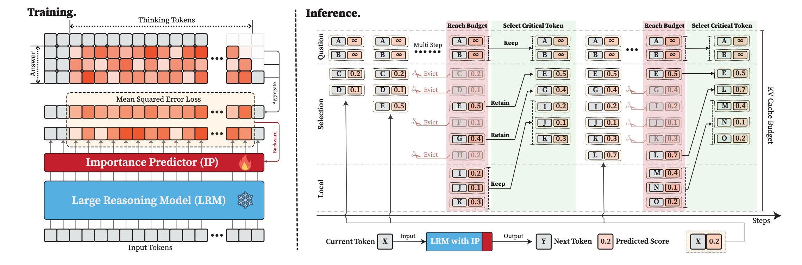
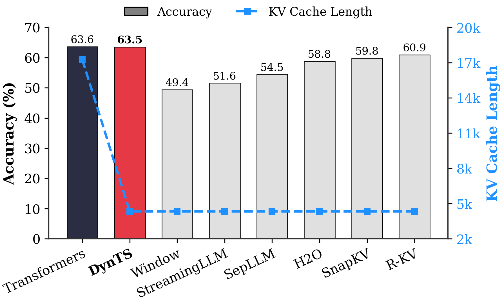

# DynTS: Dynamic Thinking-Token Selection for Efficient Reasoning in Large Reasoning Models

This is the official repository for **DynTS**.






## Quick Start

The following steps outline how to train the importance predictor using `deepseek-ai/DeepSeek-R1-Distill-Llama-8B` on `MATH500`, and subsequently run inference on `AIME24` using DynTS.

Datasets should be downloaded manually and put into `datas/dataset/${DATASET_NAME}`. `${DATASET_NAME}` must be one of `aime24`, `aime25`, `amc23`, `gaokao2023en`, `gpqa_d`, `math500`.

```bash
# 1. Install python environment
conda env create -f environment
conda activate dynts

# 2. Generate training data for the importance predictor
bash ./recipes/sft_data_prepare/compute_sft_is.sh

# 3. Train the importance predictor
bash ./recipes/sft/sft_deepseek_llama.sh

# 4. Run inference on AIME24 using DynTS
bash ./recipes/inference/dynts_deepseek_llama.sh
```

Evaluation results for `AIME24` will be saved in `outputs/inference/dynts-llama`.


## Train LRMs with Importance Predictor

### Generate Data for SFT

To fine-tune LRMs (Large Reasoning Models) with an importance predictor, first run the data preparation script. This script utilizes vLLM to generate importance scores for each token on a specific dataset.

```bash
bash ./recipes/sft_data_prepare/compute_sft_is.sh
```

- **Note**: In our paper, we use `math500` as the training dataset, but this can be adapted to other datasets.
- **Configuration**: Target models and datasets can be configured directly inside compute_sft_is.sh.
- **Output**: The generated importance scores will be saved to `datas/train/${MODEL_NAME}_{$DATA_NAME}_is.jsonl`.


## SFT Importance Predictor

After generating the importance scores, use the following scripts to fine-tune the models:

```bash
bash recipes/sft/sft_deepseek_{llama|qwen}.sh
```

The checkpoint of the fine-tuned model (integrated with the importance predictor) will be located at `outputs/models/${MODEL_NAME}_ip/checkpoints/global_step_405`. This path can be directly passed to the `--model_name_and_path` argument in the inference scripts.


## Inference & Evaluation

### Running Inference

Inference scripts are located in `recipes/inference`. For example, to run inference with `DeepSeek-R1-Llama-8B` using DynTS:

```bash
bash ./recipes/inference/dynts_deepseek_llama.sh
```

### Supported Benchmarks

You can run any of the following benchmarks by setting the `DATA_NAME` variable in the script:

- `aime24`
- `aime25`
- `amc23`
- `gaokao2023en`
- `gpqa_d`
- `math500`

### Supported Pruning Strategies

We currently implement eight KV cache pruning strategies:

- **DynTS (Ours)**
- Vanilla Transformers
- Local Window
- Streaming LLM
- SepLLM
- H2O
- SnapKV
- R-KV


### Outputs

After execution, the results will be saved in `SAVE_DIR` with the following structure:

- `metrics.jsonl`: A comprehensive summary of metrics, including PASS@5, MAJOR@5, PASS@1, Throughput, Latency, and Peak KV Cache Usage.
- `files/`: Contains the model's raw answers for each question (useful for debugging).
- `statistics/`: Contains detailed metrics for each decoding step.


## Ablation Study

Scripts for reproducing our ablation study results can be found in `recipes/ablation`:

- `budget_{MODEL}`: Analyzes the influence of the KV cache budget.
- `local_ratio_{MODEL}`: Analyzes the influence of the local window size and ratio.
- `wolocal_{MODEL}`: Runs DynTS without the local window.
- `select_{MODEL}`: Runs DynTS using diverse token selection strategies (e.g., w/o question tokens, w/o thinking tokens, random thinking tokens, bottom thinking tokens).